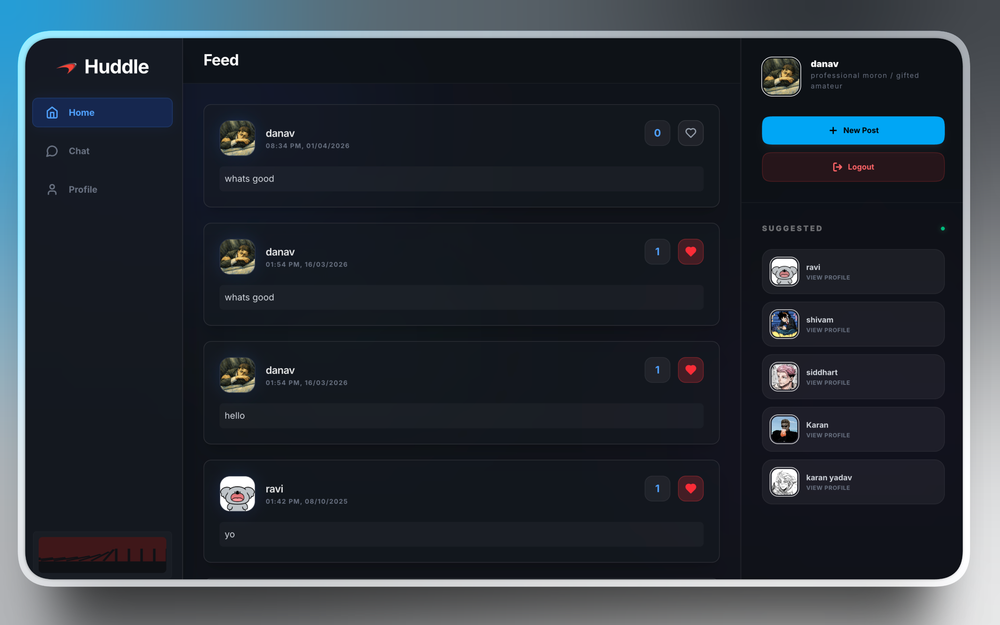

# Huddle

A premium, modern social networking application built for deep connections and meaningful conversations. Huddle features a stunning glassmorphism design, real-time interactions, and smart chatrooms tailored for language learners and enthusiasts.



## Key Features

- **Global Feed**: Real-time social feed where users can share thoughts, capture moments, and interact with the community.
- **Chatrooms**: Localized chatrooms that connect you with people speaking or learning the same languages as you.
- **Personalized Profiles**: Showcase your identity with a unique bio, profile picture, and language preferences.
- **Real-time Engine**: Powered by Firebase for instant messaging, posting, and live updates.

## Tech Stack

- **Framework**: [React](https://reactjs.org/) + [Vite](https://vitejs.dev/)
- **Styling**: [Tailwind CSS](https://tailwindcss.com/) 
- **Database & Auth**: [Firebase](https://firebase.google.com/) (Real-time Database & Authentication)
- **Animations**: [AOS](https://michalsnik.github.io/aos/) (Animate On Scroll)
- **Icons**: [Lucide React](https://lucide.dev/)

## Getting Started

### Prerequisites

- Node.js (Latest Stable)
- npm or yarn

### Installation

1. **Clone the repository**
   ```bash
   git clone <https://github.com/Manav437/Huddle>
   cd "Social Media App/frontend/Social-Media-App"
   ```

2. **Install dependencies**
   ```bash
   npm install
   ```

3. **Environment Setup**
   Create a `.env` file in the root of `frontend/Social-Media-App` and add your Firebase configuration:
   ```env
   VITE_FIREBASE_API_KEY=your_api_key
   VITE_FIREBASE_AUTH_DOMAIN=your_auth_domain
   VITE_FIREBASE_DATABASE_URL=your_database_url
   VITE_FIREBASE_PROJECT_ID=your_project_id
   VITE_FIREBASE_STORAGE_BUCKET=your_storage_bucket
   VITE_FIREBASE_MESSAGING_SENDER_ID=your_sender_id
   VITE_FIREBASE_APP_ID=your_app_id
   ```

4. **Run development server**
   ```bash
   npm run dev
   ```

## Project Structure

```text
src/
├── components/      # UI Components (Navbar, PostCard, Modals, etc.)
├── context/         # AuthContext and Global State
├── firebase.js      # Firebase Configuration
├── services/        # API and Firebase Service logic
├── utils/           # Helper functions (formatDate, etc.)
└── App.jsx          # Main Routing and App Logic
```
